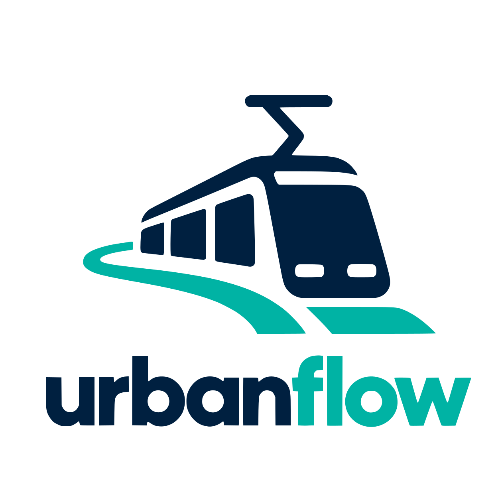
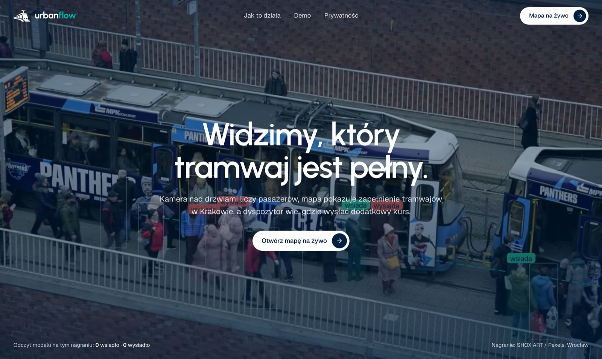
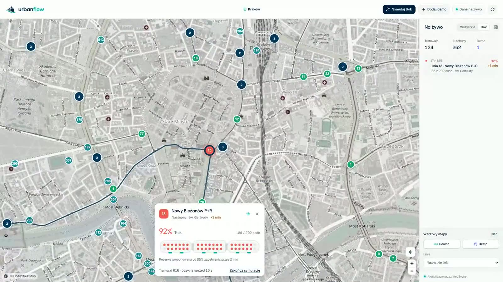
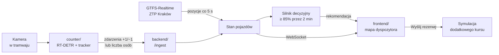
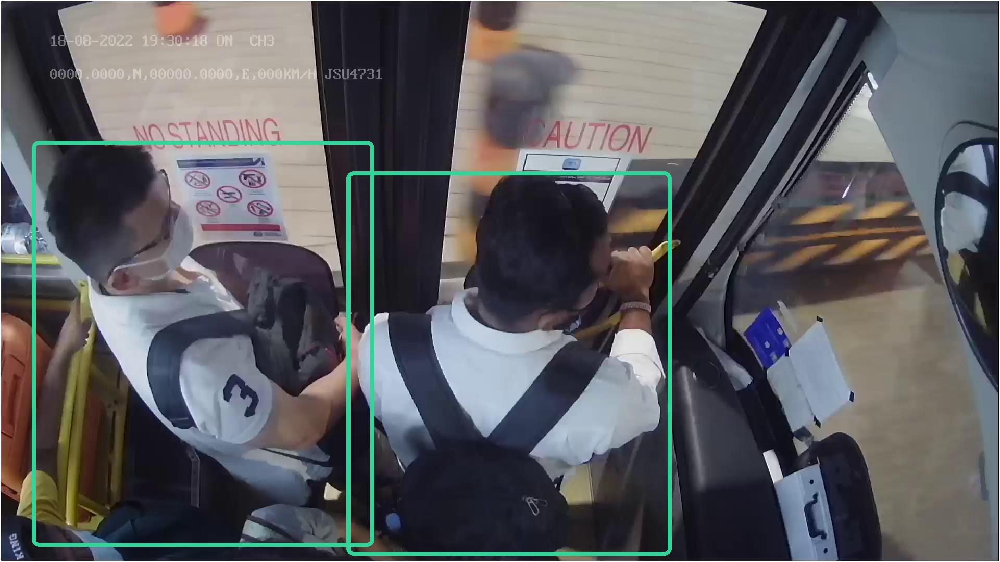
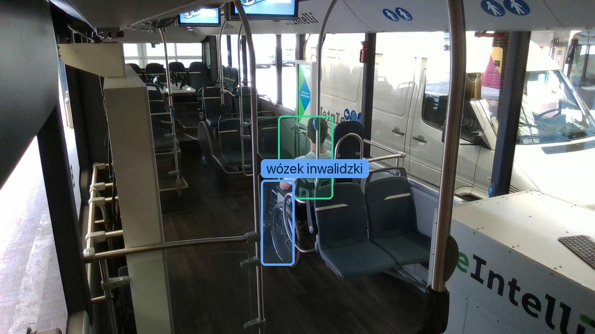

<div align="center">



# UrbanFlow

**Widzimy, który tramwaj jest pełny.**

Kamera liczy pasażerów, mapa pokazuje zapełnienie krakowskich tramwajów na żywo,
a dyspozytor dostaje gotową propozycję dodatkowego kursu.

</div>



## Spis treści

- [Co robi](#co-robi)
- [Jak to działa](#jak-to-działa)
- [Szybki start](#szybki-start)
- [Demo w pięć minut](#demo-w-pięć-minut)
- [Licznik pasażerów](#licznik-pasażerów)
- [API](#api)
- [Struktura repozytorium](#struktura-repozytorium)
- [Testy](#testy)
- [Stan prototypu](#stan-prototypu)
- [Materiały i podziękowania](#materiały-i-podziękowania)

## Co robi

Feed GTFS-Realtime ZTP Kraków mówi, gdzie jest każdy tramwaj i ile ma opóźnienia. Nie mówi,
ilu ludzi jest w środku. UrbanFlow dokłada tę informację:

- **Liczy pasażerów kamerą.** Nad drzwiami: kto wsiada, kto wysiada. W wagonie: ile osób,
  wózków inwalidzkich, wózków dziecięcych i rowerów jest w środku.
- **Pokazuje zapełnienie na mapie na żywo.** Każdy tramwaj z licznikiem ma swój kolor i kartę
  z widokiem wnętrza.
- **Proponuje rezerwę.** Gdy tramwaj jest pełny (≥ 85%) przez dwie minuty, dyspozytor dostaje
  rekomendację dodatkowego kursu i wysyła go jednym kliknięciem. Decyzja zawsze należy
  do człowieka.
- **Chroni prywatność.** Model działa na urządzeniu w wagonie. Do serwera trafiają tylko
  liczby, nigdy obraz.



## Jak to działa



| Kamera nad drzwiami | Kamera w wagonie |
|---|---|
|  |  |
| Liczy przejścia przez próg; backend sumuje bilans. | Podaje bezwzględną liczbę osób i wózków; koryguje bilans. |

## Szybki start

Wymagania: Python 3.12+, [uv](https://github.com/astral-sh/uv), Node.js 22+.

```bash
# 1. Backend na prawdziwym feedzie ZTP (http://localhost:8000)
cd backend
uv sync --extra dev
REALTIME_ENABLED=true SEED_FIXTURES=false uv run uvicorn app.main:app --reload --port 8000

# 2. Frontend (http://localhost:5173)
cd frontend
npm install
npm run dev
```

- `http://localhost:5173` to strona projektu.
- `http://localhost:5173/mapa` to mapa dyspozytora.
- `http://localhost:8000/docs` to dokumentacja API (Swagger).

Backend na innym porcie? Uruchom frontend z `VITE_API_BASE_URL=http://localhost:<port>/api/v1`.

Bez dostępu do internetu: `SEED_FIXTURES=true REALTIME_ENABLED=false` podnosi backend
z kilkoma przykładowymi pojazdami zamiast feedu ZTP.

**Docker:** `docker compose up --build` uruchamia oba serwisy na tych samych portach.
Zmienne środowiskowe są opisane w [`.env.example`](.env.example).

## Demo w pięć minut

1. Otwórz `http://localhost:5173/mapa` (w dzień na mapie jest około 130 tramwajów).
2. Kliknij **Symuluj tłok**. Backend wybiera tramwaj najbliżej centrum i ustawia go na 186
   z 202 osób, z przykładowym wózkiem inwalidzkim i dziecięcym. Mapa śledzi ten tramwaj.
3. Po około dwóch minutach pojawia się karta **„Linia … jest przepełniona”**: pulsuje,
   gra krótki dźwięk i pokazuje licznik w tytule karty przeglądarki.
4. Kliknij **Wyślij rezerwę**. Na mapie rusza dodatkowy tramwaj trasą tej linii.

Symulowany tłok przechodzi tą samą drogą co dane z prawdziwej kamery, więc kolor na mapie,
historia i rekomendacja są prawdziwe; zmyślona jest tylko liczba pasażerów. Po 10 minutach
symulacja sama się kończy.

## Licznik pasażerów

Katalog [`counter/`](counter/) to program działający przy kamerze. Wykrywa ludzi modelem
RT-DETR (Apache-2.0), śledzi ich między klatkami i liczy przejścia przez linię w progu.
Szczegóły uruchomienia, w tym z kamery laptopa: [`counter/README.md`](counter/README.md).

```bash
cd backend && uv run python -m scripts.provision_device --vehicle-id ztp-tram:326   # klucz urządzenia
cd counter && uv sync --extra ml
uv run count-doorway --source 0 --preview --torch-device mps --device-key tbn_...
```

Skrypty pomocnicze w `backend/scripts/`:

| Skrypt | Do czego |
|---|---|
| `provision_device` | Wydaje klucz urządzenia dla pojazdu; w pliku zostaje tylko hash. |
| `demo_overload` | Trzyma wybrany tramwaj pełnym przez API licznika (`--no-dispatch` na pokaz). |
| `cabin_feed` | Odtwarza zapis z kamery w wagonie jako kolejne odczyty dla tramwaju. |

## API

Wszystkie ścieżki pod prefiksem `/api/v1`. Pełny opis: `http://localhost:8000/docs`.

| Metoda i ścieżka | Opis |
|---|---|
| `GET /vehicles` | Pojazdy z pozycją, opóźnieniem i zapełnieniem |
| `GET /vehicles/{id}` · `/history` | Szczegóły i historia pojazdu |
| `GET /routes` · `/{id}/shape` | Linie i geometria trasy |
| `POST /ingest/passages` | Partia zdarzeń z licznika (klucz urządzenia, idempotentna po `eventId`) |
| `POST /ingest/anchor` | Bezwzględna liczba osób, opcjonalnie z wózkami i rowerami |
| `GET /recommendations` · `POST /{id}/dismiss` | Rekomendacje dodatkowego kursu |
| `POST /mock-dispatch/extra-trams` | Wysłanie rezerwy (symulacja) |
| `POST /demo/overload` | Symulowany tłok na prawdziwym tramwaju |
| `WS /live` | Aktualizacje pojazdów i rekomendacji na żywo |

## Struktura repozytorium

```
backend/     FastAPI: feed GTFS-Realtime, przyjmowanie danych z liczników, silnik decyzyjny
counter/     Licznik pasażerów: RT-DETR, tracker, wysyłka zdarzeń do backendu
frontend/    Next.js (vinext) + MapLibre: strona projektu (/) i mapa dyspozytora (/mapa)
docs/        Plan wdrożenia, propozycja silnika decyzyjnego v2, logo, zrzuty ekranu
```

## Testy

```bash
cd backend && uv run --extra dev pytest      # API, przyjmowanie danych, rekomendacje
cd counter && uv run pytest                  # geometria linii, tracker, wysyłka zdarzeń
cd frontend && npx tsc --noEmit && npm run lint
```

Te same kroki uruchamia GitHub Actions przy każdym pushu.

## Stan prototypu

To działający prototyp na hackathon, nie system produkcyjny.

- **Stan jest w pamięci.** Restart backendu zeruje liczniki i rekomendacje.
- **Model jest ogólny, bez douczania.** Na nagraniach z kamer nad drzwiami i pod sufitem
  autobusu wykrywa ludzi dobrze. Pełnego wagonu w godzinach szczytu z kamery w krakowskim
  tramwaju jeszcze nie sprawdziliśmy.
- **Kilka kamer w jednym wagonie liczy niezależnie.** Bez podziału na strefy ta sama osoba
  widziana z dwóch kamer liczy się dwa razy.
- **Wózki wykrywa wolny model OWLv2** (około 1 s na klatkę). Docelowo ten sam szybki
  detektor po douczeniu.
- **Odstęp do następnego kursu i dostępność rezerw to stałe** (`LIVE_ASSUMED_*`
  w `backend/app/services/state_store.py`), a wagi miejsca wózków i rowerów to założenia.
- **Pewność pomiaru (`OCCUPANCY_CONFIDENCE`) jest zadeklarowana,** nie zmierzona.

Następne kroki: nagrania z monitoringu krakowskich tramwajów do sprawdzenia i douczenia
modelu, strefy dla kamer w wagonie, prawdziwe dane o rezerwach i prognoza tłoku.

## Materiały i podziękowania

- Pozycje pojazdów: [GTFS-Realtime ZTP Kraków](https://gtfs.ztp.krakow.pl).
- Mapa: © [OpenStreetMap](https://www.openstreetmap.org/copyright).
- Detektor: [RT-DETR](https://huggingface.co/PekingU/rtdetr_r18vd_coco_o365) (Apache-2.0);
  wózki: [OWLv2](https://huggingface.co/google/owlv2-base-patch16-ensemble) (Apache-2.0).
- Nagrania i zdjęcia na stronie (ramki dodane przez nasz model):
  - przystanek we Wrocławiu: SHOX ART, [Pexels](https://www.pexels.com/video/city-tram-stop-with-passengers-boarding-29414701/);
  - kamery w autobusie: TU Berlin / MAN Truck & Bus, [Multi-View In-Cabin Dataset](https://github.com/EvgenyGorelik/multiview_incabin_dataset), CC BY 4.0;
  - kamera nad drzwiami: topviewhuman, [Roboflow Universe](https://universe.roboflow.com/topviewhuman/_bus_passenger_camera_middle_door), CC BY 4.0;
  - wózki w autobusie: Metropolitan Transportation Authority, Wikimedia Commons, CC BY 2.0;
  - rower w wagonie: citytransportinfo, Wikimedia Commons, CC0.
- Bazowa wersja mapy, integracji GTFS i silnika decyzyjnego:
  [komar](https://github.com/0xKomar) ([0xKomar/TBN](https://github.com/0xKomar/TBN)).
